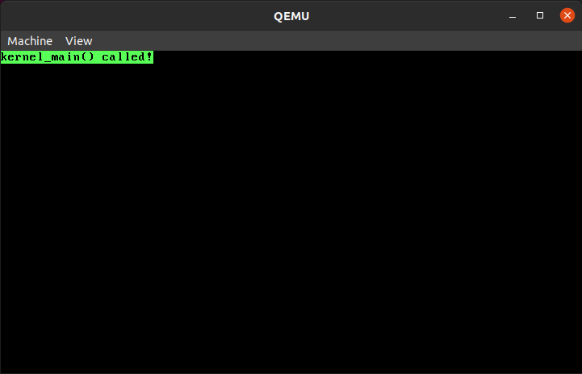

# NoobOS

A simple OS

## What does this do?

For now nothing

## Purpose

Literally nothing

## Building the project

If your system needs to set file permissions for the build script, use the command below:

`chmod +x build.sh`

Once permissions are set, run the command below to compile the source files and boot the OS:

`./build.sh`

See **dependencies** for more info on required libraries and software installed

## Working Screenshot

## Dependencies

- QEMU
- gcc
- NASM
- WSL (Windows machines only)

## Pre-requisites

- Knowledge of C programming
- Basics of Assembly x86
- Basics of operating systems
- Registers and flags (x86 architecture)

## References

- [VGA text mode](https://en.wikipedia.org/wiki/VGA_text_mode)
- [Multiboot](https://www.gnu.org/software/grub/manual/multiboot/multiboot.html)
- [How does assembly bootloader code work?](https://stackoverflow.com/questions/34183799/how-does-this-assembly-bootloader-code-work)

## Alternative sources

- [OS tutorial by cfenollosa](https://github.com/cfenollosa/os-tutorial)

## Credits

- [Vineeth B V](https://github.com/vinsdragonis)
